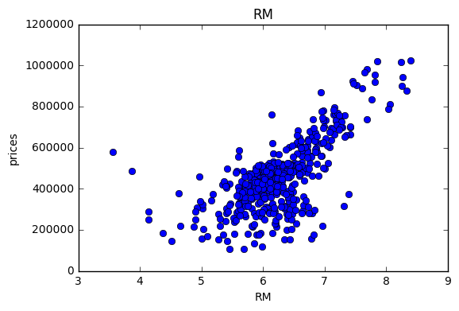
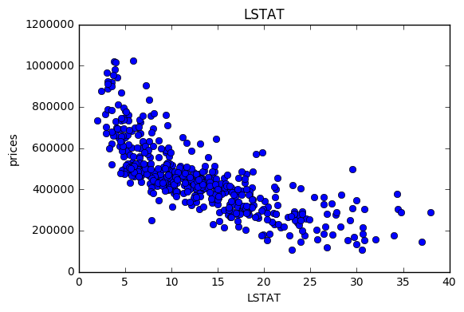
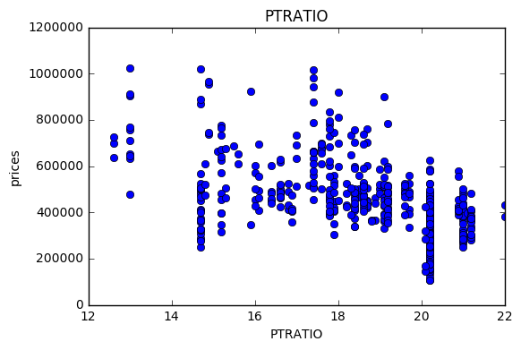
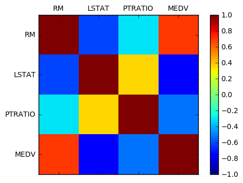
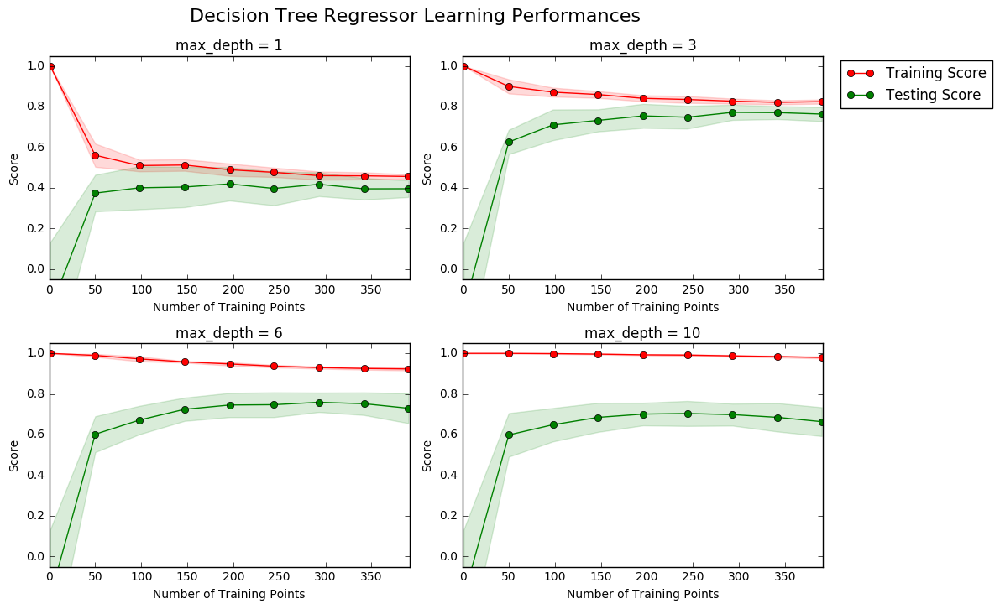
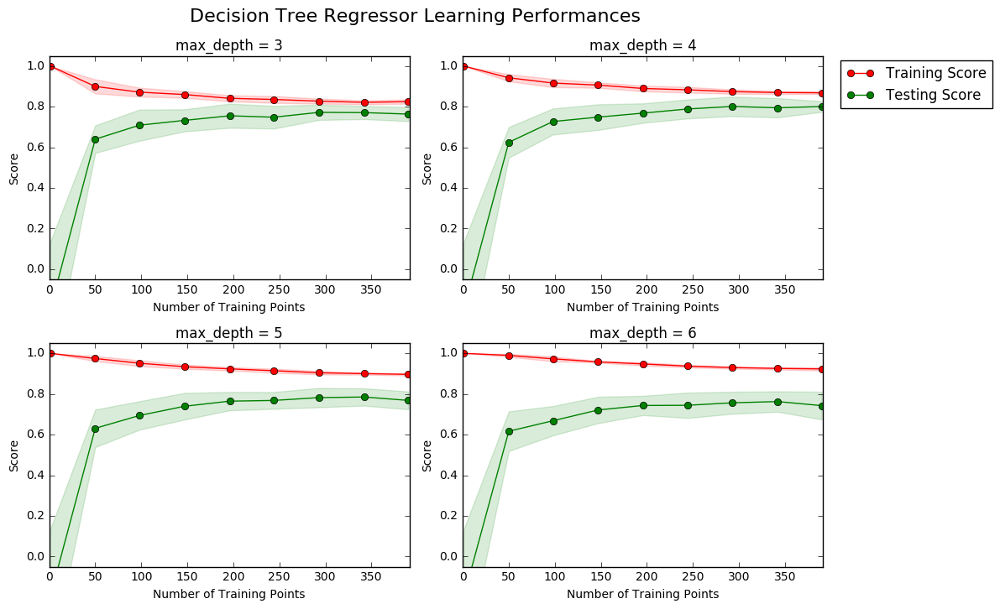
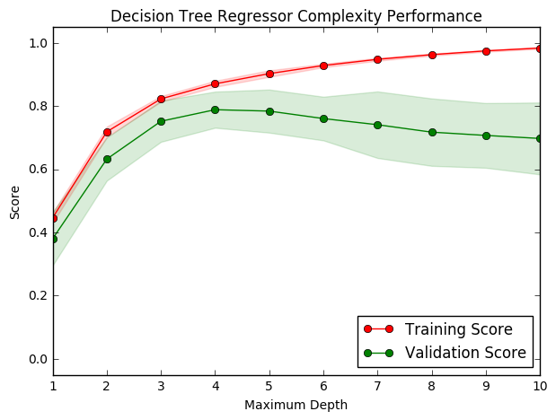

# Machine Learning Engineer Nanodegree
## Model Evaluation & Validation
### Project: Predicting Boston Housing Prices
Welcome to the first project of the Machine Learning Engineer Nanodegree! In this notebook, some template code has already been provided for you, and you will need to implement additional functionality to successfully complete this project. You will not need to modify the included code beyond what is requested. Sections that begin with **'Implementation'** in the header indicate that the following block of code will require additional functionality which you must provide. Instructions will be provided for each section and the specifics of the implementation are marked in the code block with a **'TODO'** statement. Please be sure to read the instructions carefully!

In addition to implementing code, there will be questions that you must answer which relate to the project and your implementation. Each section where you will answer a question is preceded by a **'Question X'** header. Carefully read each question and provide thorough answers in the following text boxes that begin with **'Answer:'**. Your project submission will be evaluated based on your answers to each of the questions and the implementation you provide.

**Note:** Code and Markdown cells can be executed using the **Shift + Enter** keyboard shortcut. In addition, Markdown cells can be edited by typically double-clicking the cell to enter edit mode.

## Getting Started
In this project, you will evaluate the performance and predictive power of a model that has been trained and tested on data collected from homes in suburbs of Boston, Massachusetts. A model trained on this data that is seen as a good fit could then be used to make certain predictions about a home — in particular, its monetary value. This model would prove to be invaluable for someone like a real estate agent who could make use of such information on a daily basis.

The dataset for this project originates from the UCI Machine Learning Repository. The Boston housing data was collected in 1978 and each of the 506 entries represent aggregated data about 14 features for homes from various suburbs in Boston, Massachusetts. For the purposes of this project, the following preprocessing steps have been made to the dataset:

- 16 data points have an 'MEDV' value of 50.0. These data points likely contain missing or censored values and have been removed.
- 1 data point has an 'RM' value of 8.78. This data point can be considered an outlier and has been removed.
- The features 'RM', 'LSTAT', 'PTRATIO', and 'MEDV' are essential. The remaining non-relevant features have been excluded.
- The feature 'MEDV' has been multiplicatively scaled to account for 35 years of market inflation.

Run the code cell below to load the Boston housing dataset, along with a few of the necessary Python libraries required for this project. You will know the dataset loaded successfully if the size of the dataset is reported.


```python
# Import libraries necessary for this project
import numpy as np
import pandas as pd
from sklearn.cross_validation import ShuffleSplit
import matplotlib.pyplot as pl
import sklearn.learning_curve as curves
from sklearn.tree import DecisionTreeRegressor
import os
os.chdir('C:/Users/Rmy/Desktop/Udacity/Boston_Housing_MLNDP_Project 1/machine-learning/projects/boston_housing')

# Import supplementary visualizations code visuals.py
import visuals as vs

# Pretty display for notebooks
%matplotlib inline

# Load the Boston housing dataset
data = pd.read_csv('housing.csv')
prices = data['MEDV']
features = data.drop('MEDV', axis = 1)
    
# Success
print "Boston housing dataset has {} data points with {} variables each.".format(*data.shape)
```

    Boston housing dataset has 489 data points with 4 variables each.
    


## Data Exploration
In this first section of this project, you will make a cursory investigation about the Boston housing data and provide your observations. Familiarizing yourself with the data through an explorative process is a fundamental practice to help you better understand and justify your results.

Since the main goal of this project is to construct a working model which has the capability of predicting the value of houses, we will need to separate the dataset into features and the target variable. The features, 'RM', 'LSTAT', and 'PTRATIO', give us quantitative information about each data point. The target variable, 'MEDV', will be the variable we seek to predict. These are stored in features and prices, respectively.

### Implementation: Calculate Statistics
For your very first coding implementation, you will calculate descriptive statistics about the Boston housing prices. Since numpy has already been imported for you, use this library to perform the necessary calculations. These statistics will be extremely important later on to analyze various prediction results from the constructed model.

In the code cell below, you will need to implement the following:
- Calculate the minimum, maximum, mean, median, and standard deviation of 'MEDV', which is stored in prices.
 - Store each calculation in their respective variable.


```python
# TODO: Minimum price of the data
minimum_price = np.min(prices)

# TODO: Maximum price of the data
maximum_price = np.max(prices)

# TODO: Mean price of the data
mean_price = np.mean(prices)

# TODO: Median price of the data
median_price = np.median(prices)

# TODO: Standard deviation of prices of the data
std_price = np.std(prices)

# Show the calculated statistics
print "Statistics for Boston housing dataset:\n"
print "Minimum price: ${:,.2f}".format(minimum_price)
print "Maximum price: ${:,.2f}".format(maximum_price)
print "Mean price: ${:,.2f}".format(mean_price)
print "Median price ${:,.2f}".format(median_price)
print "Standard deviation of prices: ${:,.2f}".format(std_price)
```

    Statistics for Boston housing dataset:
    
    Minimum price: $105,000.00
    Maximum price: $1,024,800.00
    Mean price: $454,342.94
    Median price $438,900.00
    Standard deviation of prices: $165,171.13
    

### Question 1 - Feature Observation
As a reminder, we are using three features from the Boston housing dataset: 'RM', 'LSTAT', and 'PTRATIO'. For each data point (neighborhood):

- 'RM' is the average number of rooms among homes in the neighborhood.
- 'LSTAT' is the percentage of homeowners in the neighborhood considered "lower class" (working poor).
- 'PTRATIO' is the ratio of students to teachers in primary and secondary schools in the neighborhood.

Using your intuition, for each of the three features above, do you think that an increase in the value of that feature would lead to an increase in the value of 'MEDV' or a decrease in the value of 'MEDV'? Justify your answer for each.

Hint: Would you expect a home that has an 'RM' value of 6 be worth more or less than a home that has an 'RM' value of 7?

**Answer:**
<font color='blue'>
<br>As per my intuition, an increase in 'RM' and 'PTRATIO' will result in an increase in the 'MEDV' value. But, an increase in the 'LSTAT' value will decrease the 'MEDV' value significantly.<br />
<br>For example, if a house has eight rooms and a nominal student to teacher ratio of 15.5 and the lower income class percentage to be 10% then the house prices will be lower in that area.<br />
<br>In another example, if a house has the same eight rooms and the same student to teacher ratio of 15.5, but this time the lower income class percentage is 4% then the house prices will be higher than the previous example given above.<br />
<br>Based on the output graphs and the correlation matrix shown below, we can see that 'RM' is positively correlated and other two features are negatively correlated.<br />
</font>


```python
import matplotlib.pyplot as plt
plt.plot(data['RM'], prices, 'o')
plt.title('RM')
plt.xlabel('RM')
plt.ylabel('prices')
```


    <matplotlib.text.Text at 0xa0d8a90>





```python
plt.plot(data['LSTAT'], prices, 'o')
plt.title('LSTAT')
plt.xlabel('LSTAT')
plt.ylabel('prices')
```


    <matplotlib.text.Text at 0xa1e4270>





```python
plt.plot(data['PTRATIO'], prices, 'o')
plt.title('PTRATIO')
plt.xlabel('PTRATIO')
plt.ylabel('prices')
```


    <matplotlib.text.Text at 0xa1d53f0>





```python
names = ['RM','LSTAT','PTRATIO','MEDV']
correlations = data.corr()
# plot correlation matrix
fig = plt.figure()
ax = fig.add_subplot(111)
cax = ax.matshow(correlations, vmin=-1, vmax=1)
fig.colorbar(cax)
ticks = np.arange(0,4,1)
ax.set_xticks(ticks)
ax.set_yticks(ticks)
ax.set_xticklabels(names)
ax.set_yticklabels(names)
plt.show()
```





```python
data.corr()
```


<div>
<table border="1" class="dataframe">
  <thead>
    <tr style="text-align: right;">
      <th></th>
      <th>RM</th>
      <th>LSTAT</th>
      <th>PTRATIO</th>
      <th>MEDV</th>
    </tr>
  </thead>
  <tbody>
    <tr>
      <th>RM</th>
      <td>1.000000</td>
      <td>-0.612033</td>
      <td>-0.304559</td>
      <td>0.697209</td>
    </tr>
    <tr>
      <th>LSTAT</th>
      <td>-0.612033</td>
      <td>1.000000</td>
      <td>0.360445</td>
      <td>-0.760670</td>
    </tr>
    <tr>
      <th>PTRATIO</th>
      <td>-0.304559</td>
      <td>0.360445</td>
      <td>1.000000</td>
      <td>-0.519034</td>
    </tr>
    <tr>
      <th>MEDV</th>
      <td>0.697209</td>
      <td>-0.760670</td>
      <td>-0.519034</td>
      <td>1.000000</td>
    </tr>
  </tbody>
</table>
</div>


## Developing a Model
In this second section of the project, you will develop the tools and techniques necessary for a model to make a prediction. Being able to make accurate evaluations of each model's performance through the use of these tools and techniques helps to greatly reinforce the confidence in your predictions.

### Implementation: Define a Performance Metric
It is difficult to measure the quality of a given model without quantifying its performance over training and testing. This is typically done using some type of performance metric, whether it is through calculating some type of error, the goodness of fit, or some other useful measurement. For this project, you will be calculating the coefficient of determination, R2, to quantify your model's performance. The coefficient of determination for a model is a useful statistic in regression analysis, as it often describes how "good" that model is at making predictions.

The values for R2 range from 0 to 1, which captures the percentage of squared correlation between the predicted and actual values of the target variable. A model with an R2 of 0 is no better than a model that always predicts the mean of the target variable, whereas a model with an R2 of 1 perfectly predicts the target variable. Any value between 0 and 1 indicates what percentage of the target variable, using this model, can be explained by the features. A model can be given a negative R2 as well, which indicates that the model is arbitrarily worse than one that always predicts the mean of the target variable.

For the performance_metric function in the code cell below, you will need to implement the following:
- Use r2_score from sklearn.metrics to perform a performance calculation between y_true and y_predict.
- Assign the performance score to the score variable.


```python
# TODO: Import 'r2_score'
from sklearn.metrics import r2_score

def performance_metric(y_true, y_predict):
    """ Calculates and returns the performance score between 
        true and predicted values based on the metric chosen. """
    
    # TODO: Calculate the performance score between 'y_true' and 'y_predict'
    score = r2_score(y_true, y_predict)
    
    # Return the score
    return score
```

### Question 2 - Goodness of Fit
Assume that a dataset contains five data points and a model made the following predictions for the target variable:

|True Value	|Prediction
|:---------:|:---------:
|3.0	|2.5
|-0.5	|0.0
|2.0	|2.1
|7.0	|7.8
|4.2	|5.3

*Would you consider this model to have successfully captured the variation of the target variable? Why or why not?*

Run the code cell below to use the performance_metric function and calculate this model's coefficient of determination.


```python
# Calculate the performance of this model
score = performance_metric([3, -0.5, 2, 7, 4.2], [2.5, 0.0, 2.1, 7.8, 5.3])
print "Model has a coefficient of determination, R^2, of {:.3f}.".format(score)
```

    Model has a coefficient of determination, R^2, of 0.923.
    


```python

```

**Answer:**
<font color='blue'>
<br>
R-squared is the coefficient of determination which measures the closeness of the data to the regression line fitted by the model. R-squared value always lies between 0 to 1. Higher the value of R-squared means the model generated regression line fits the data.
<br />
<br>
The model has successfully captured the variation in the target variable because it has a coefficient of determination of 92.3% which means the model was able to predict the target value almost 92.3% of the time accurately.
<br />
</font>

### Implementation: Shuffle and Split Data
Your next implementation requires that you take the Boston housing dataset and split the data into training and testing subsets. Typically, the data is also shuffled into a random order when creating the training and testing subsets to remove any bias in the ordering of the dataset.

For the code cell below, you will need to implement the following:

- Use train_test_split from sklearn.cross_validation to shuffle and split the features and prices data into training and testing sets.
  - Split the data into 80% training and 20% testing.
  - Set the random_state for train_test_split to a value of your choice. This ensures results are consistent.
- Assign the train and testing splits to X_train, X_test, y_train, and y_test.


```python
# TODO: Import 'train_test_split'
from sklearn.cross_validation import train_test_split

# TODO: Shuffle and split the data into training and testing subsets
X_train, X_test, y_train, y_test = train_test_split (features, prices, test_size=0.2, random_state=1985)

# Success
print "Training and testing split was successful."
```

    Training and testing split was successful.
    

### Question 3 - Training and Testing
*What is the benefit to splitting a dataset into some ratio of training and testing subsets for a learning algorithm?*

Hint: What could go wrong with not having a way to test your model?

**Answer:**
<font color='blue'>
<br> Any supervised learning algorithm needs training on a dataset and once trained the model requires a validation or test dataset to evaluate the accuracy of the trained model using various performance metrics. 
<br />
<br>
If we do not split the data and train any learning algorithm on the entire dataset, we might run a risk of overfitting the data which might not be generalized for any out of sample data.
<br />
<br>
When splitting the data on hand, it is expected to allocate a higher percentage of the observations to the training dataset. The training and testing dataset are used in determining the conditions like overfitting and underfitting by any learning algorithm.
<br>
<br />
In our model, we are using an 80/20 split between training and testing dataset.
<br />
</font>

## Analyzing Model Performance
In this third section of the project, you'll take a look at several models' learning and testing performances on various subsets of training data. Additionally, you'll investigate one particular algorithm with an increasing 'max_depth' parameter on the full training set to observe how model complexity affects performance. Graphing your model's performance based on varying criteria can be beneficial in the analysis process, such as visualizing behavior that may not have been apparent from the results alone.

## Learning Curves
The following code cell produces four graphs for a decision tree model with different maximum depths. Each graph visualizes the learning curves of the model for both training and testing as the size of the training set is increased. Note that the shaded region of a learning curve denotes the uncertainty of that curve (measured as the standard deviation). The model is scored on both the training and testing sets using R2, the coefficient of determination.

Run the code cell below and use these graphs to answer the following question.


```python
# Produce learning curves for varying training set sizes and maximum depths (1,3,6,10)
vs.ModelLearning(features, prices)
```





```python
def ML(X, y):
    """ Calculates the performance of several models with varying sizes of training data.
        The learning and testing scores for each model are then plotted. """
    
    # Create 10 cross-validation sets for training and testing
    cv = ShuffleSplit(X.shape[0], n_iter = 10, test_size = 0.2, random_state = 0)

    # Generate the training set sizes increasing by 50
    train_sizes = np.rint(np.linspace(1, X.shape[0]*0.8 - 1, 9)).astype(int)

    # Create the figure window
    fig = pl.figure(figsize=(10,7))

    # Create three different models based on max_depth
    for k, depth in enumerate([3,4,5,6]):
        
        # Create a Decision tree regressor at max_depth = depth
        regressor = DecisionTreeRegressor(max_depth = depth)

        # Calculate the training and testing scores
        sizes, train_scores, test_scores = curves.learning_curve(regressor, X, y, \
            cv = cv, train_sizes = train_sizes, scoring = 'r2')
        
        # Find the mean and standard deviation for smoothing
        train_std = np.std(train_scores, axis = 1)
        train_mean = np.mean(train_scores, axis = 1)
        test_std = np.std(test_scores, axis = 1)
        test_mean = np.mean(test_scores, axis = 1)

        # Subplot the learning curve 
        ax = fig.add_subplot(2, 2, k+1)
        ax.plot(sizes, train_mean, 'o-', color = 'r', label = 'Training Score')
        ax.plot(sizes, test_mean, 'o-', color = 'g', label = 'Testing Score')
        ax.fill_between(sizes, train_mean - train_std, \
            train_mean + train_std, alpha = 0.15, color = 'r')
        ax.fill_between(sizes, test_mean - test_std, \
            test_mean + test_std, alpha = 0.15, color = 'g')
        
        # Labels
        ax.set_title('max_depth = %s'%(depth))
        ax.set_xlabel('Number of Training Points')
        ax.set_ylabel('Score')
        ax.set_xlim([0, X.shape[0]*0.8])
        ax.set_ylim([-0.05, 1.05])
    
    # Visual aesthetics
    ax.legend(bbox_to_anchor=(1.05, 2.05), loc='lower left', borderaxespad = 0.)
    fig.suptitle('Decision Tree Regressor Learning Performances', fontsize = 16, y = 1.03)
    fig.tight_layout()
    fig.show()
```


```python
# Produce learning curves for varying training set sizes and maximum depths (3,4,5,6)
ML(features, prices)
```





### Question 4 - Learning the Data
Choose one of the graphs above and state the maximum depth for the model. What happens to the score of the training curve as more training points are added?*
What about the testing curve? Would having more training points benefit the model?

Hint: Are the learning curves converging to particular scores?

**Answer:**
<font color='blue'>
<br> Let's take the one of the graph above with the maximum depth of one; the training score drops drastically after a specific data point and similarly the testing score increases after a particular data point and then both the lines plateau. Since we see a clear case of 'High Bias' at the maximum depth of one, there is no value in adding more data points. Instead, we can work on adding any new feature or using another model.
<br />
</font>

### Complexity Curves
The following code cell produces a graph for a decision tree model that has been trained and validated on the training data using different maximum depths. The graph produces two complexity curves — one for training and one for validation. Similar to the learning curves, the shaded regions of both the complexity curves denote the uncertainty in those curves, and the model is scored on both the training and validation sets using the performance_metric function.

Run the code cell below and use this graph to answer the following two questions.


```python
vs.ModelComplexity(X_train, y_train)
```





### Question 5 - Bias-Variance Tradeoff
When the model is trained with a maximum depth of 1, does the model suffer from high bias or from high variance? How about when the model is trained with a maximum depth of 10? What visual cues in the graph justify your conclusions?

Hint: How do you know when a model is suffering from high bias or high variance?

**Answer:**
<font color='blue'>
<br> The model trained with a maximum depth of one has a 'high bias' which means that the model is under fitted and adding more data point will not help the model to improve its score. On the other hand, the model trained with a maximum depth of 10 has a 'high variance' which means the model is over fitted and this case adding more data point will help the model improve the score.<br /> 
<br>
One way to find out visually the cases of 'High Bias' and 'High Variance' is to see the training and testing scores and the point of convergence or divergence. At max depth one the score for both training and testing line is very low and stays consistant at the same level (score of around .48 and .41) after the convergence point which is a case of 'High Bias' and on the contrary, in the case of 'High Variance' at max depth ten the scores for training and test were .67 and .97 and the lines were diverging from each other.<br />
<br>
Using the complexity graph, we can see that the model suffers both 'High Bias' and 'High Variance' on the two extremes of the model maximum depths. And after the max_depth four the training score is at its highest point of .7882 and then its start to dip as more data points are added.
<br />
</font>


### Question 6 - Best-Guess Optimal Model¶
Which maximum depth do you think results in a model that best generalizes to unseen data? What intuition lead you to this answer?


**Answer:**
<font color='blue'>
<br> By observing the graph with the maximum depth of four and the model complexity graph, we can safely say that the learning algorithm with the depth of four is showing an optimal trend for both training and test scores. In the model complexity graph the training and testing lines diverge after the maximum depth of four and before that both the lines suffered from low accuracy scores.<br />
<br>
My best guess estimate is that the model will be at its best with maximum depth of four on out of sample data.
<br />
</font>


## Evaluating Model Performance
In this final section of the project, you will construct a model and make a prediction on the client's feature set using an optimized model from fit_model.


### Question 7 - Grid Search
What is the grid search technique and how it can be applied to optimize a learning algorithm?


**Answer:**
<font color='blue'>
<br> A grid search technique is used to tune the hyperparameters of an estimator or a learning algorithm. For example, in the case of decision tree regressor, there are two parameters maximum depth and weights. We can use grid search technique to tune these parameters within a certain range of possible values to maximize the accuracy or minimize the error. 
<br />
</font>


### Question 8 - Cross-Validation
What is the k-fold cross-validation training technique? What benefit does this technique provide for grid search when optimizing a model?

Hint: Much like the reasoning behind having a testing set, what could go wrong with using grid search without a cross-validated set?


**Answer:**
<font color='blue'>
<br> 
k-fold cross-validation means the sample data will be divided into k folds. For example the in a 7-fold cross validation the sample data is divided into seven equal folds and the model is run for seven iterations, and in each iteration we use six folds to train the model and one fold to test the model. We will repeat the step seven times by selecting a new fold each time to test the model and rest of the folds to train the model. In the end, we can take the average of the metrics used in the model.
<br />

<br>Now using the k-fold cross validation training technique with grid search make the optimization much more effective and the results more reliable on the out of sample data. The main benefits of using k-fold in conjunction with grid search are that the parameters can be optimized over different training and testing dataset to find the optimal parameters value with maximum accuracy or minimum error. 
<br />
</font>


### Implementation: Fitting a Model
Your final implementation requires that you bring everything together and train a model using the decision tree algorithm. To ensure that you are producing an optimized model, you will train the model using the grid search technique to optimize the 'max_depth' parameter for the decision tree. The 'max_depth' parameter can be thought of as how many questions the decision tree algorithm is allowed to ask about the data before making a prediction. Decision trees are part of a class of algorithms called supervised learning algorithms.

In addition, you will find your implementation is using ShuffleSplit() for an alternative form of cross-validation (see the 'cv_sets' variable). While it is not the K-Fold cross-validation technique you describe in Question 8, this type of cross-validation technique is just as useful!. The ShuffleSplit() implementation below will create 10 ('n_iter') shuffled sets, and for each shuffle, 20% ('test_size') of the data will be used as the validation set. While you're working on your implementation, think about the contrasts and similarities it has to the K-fold cross-validation technique.

For the fit_model function in the code cell below, you will need to implement the following:
- Use DecisionTreeRegressor from sklearn.tree to create a decision tree regressor object.
  - Assign this object to the 'regressor' variable.
- Create a dictionary for 'max_depth' with the values from 1 to 10, and assign this to the 'params' variable.
- Use make_scorer from sklearn.metrics to create a scoring function object.
 - Pass the performance_metric function as a parameter to the object.
 - Assign this scoring function to the 'scoring_fnc' variable.
- Use GridSearchCV from sklearn.grid_search to create a grid search object.
 - Pass the variables 'regressor', 'params', 'scoring_fnc', and 'cv_sets' as parameters to the object.
 - Assign the GridSearchCV object to the 'grid' variable.


```python
# TODO: Import 'make_scorer', 'DecisionTreeRegressor', and 'GridSearchCV'
from sklearn.metrics import make_scorer
from sklearn.cross_validation import ShuffleSplit
from sklearn.tree import DecisionTreeRegressor
from sklearn.grid_search import GridSearchCV


def fit_model(X, y):
    """ Performs grid search over the 'max_depth' parameter for a 
        decision tree regressor trained on the input data [X, y]. """
    
    # Create cross-validation sets from the training data
    cv_sets = ShuffleSplit(X.shape[0], n_iter = 10, test_size = 0.20, random_state = 0)

    # TODO: Create a decision tree regressor object
    regressor = DecisionTreeRegressor()

    # TODO: Create a dictionary for the parameter 'max_depth' with a range from 1 to 10
    k=range(1,11)
    params = dict(max_depth=k)

    # TODO: Transform 'performance_metric' into a scoring function using 'make_scorer' 
    scoring_fnc = make_scorer(performance_metric)

    # TODO: Create the grid search object
    grid = GridSearchCV(regressor,params,cv=cv_sets,scoring=scoring_fnc)

    # Fit the grid search object to the data to compute the optimal model
    grid = grid.fit(X, y)

    # Return the optimal model after fitting the data
    return grid.best_estimator_

```

### Making Predictions
Once a model has been trained on a given set of data, it can now be used to make predictions on new sets of input data. In the case of a decision tree regressor, the model has learned what the best questions to ask about the input data are, and can respond with a prediction for the target variable. You can use these predictions to gain information about data where the value of the target variable is unknown — such as data the model was not trained on.

### Question 9 - Optimal Model
What maximum depth does the optimal model have? How does this result compare to your guess in Question 6?

Run the code block below to fit the decision tree regressor to the training data and produce an optimal model.


```python
# Fit the training data to the model using grid search
reg = fit_model(X_train, y_train)

# Produce the value for 'max_depth'
print "Parameter 'max_depth' is {} for the optimal model.".format(reg.get_params()['max_depth'])
```

    Parameter 'max_depth' is 4 for the optimal model.
    

**Answer:**
<font color='blue'>
<br> The model returned the optimal maximum depth as four, and it matches with the best guess estimate made from the learning curves. 
<br />
</font>


### Question 10 - Predicting Selling Prices
Imagine that you were a real estate agent in the Boston area looking to use this model to help price homes owned by your clients that they wish to sell. You have collected the following information from three of your clients:

|Feature	|Client 1	|Client 2	|Client 3|
|:----:|:----:|:----:|:----:|
|Total number of rooms in home	|5 rooms	|4 rooms	|8 rooms|
|Neighborhood poverty level (as %)	|17%	|32%	|3%|
|Student-teacher ratio of nearby schools	|15-to-1	|22-to-1	|12-to-1|

What price would you recommend each client sell his/her home at? Do these prices seem reasonable given the values for the respective features?

Hint: Use the statistics you calculated in the Data Exploration section to help justify your response.

Run the code block below to have your optimized model make predictions for each client's home.


```python
# Produce a matrix for client data
client_data = [[5, 17, 15], # Client 1
               [4, 32, 22], # Client 2
               [8, 3, 12]]  # Client 3

# Show predictions
for i, price in enumerate(reg.predict(client_data)):
    print "Predicted selling price for Client {}'s home: ${:,.2f}".format(i+1, price)

```

    Predicted selling price for Client 1's home: $409,404.55
    Predicted selling price for Client 2's home: $233,234.04
    Predicted selling price for Client 3's home: $985,500.00
    

**Answer:**
<font color='blue'>
<br> The predicted prices are shown above as an output to line 32.<br />

<br>Statistics for Boston housing dataset:<br/>
<br>Minimum price: 105,000.00<br/>
<br>Maximum price: 1,024,800.00<br/>
<br>Mean price: 454,342.94<br/>
<br>Median price 438,900.00<br/>
<br>Standard deviation of prices: 165,171.13<br/>

<br>
Based on the summary statistics of the dataset we used to build the model we see that the predicted values are well within the 'MEDV' range.  And since the model was optimized on its parameters over a ten-fold training and testing dataset, we can be confident that the model is performing with high levels of accuracy in predicting the price.
<br />
<br>
In the case of client one, there are five rooms - which is two standard deviations less than the average rooms in the dataset, 17% poverty level is in the 75th percentile and 15 to 1 student to teacher ratio is approx one standard deviation below the mean. As we can see most of the features are close to the average value, the price predicted by the model is also closer to the average of the prices of the dataset (Dollars 409,404.55).
<br />

<br>
In the case of client two, there are four rooms - which is approximately the minimum value in the dataset, 32% poverty level is closer to the max value in the dataset and 22 to 1 student to teacher ratio is the maximum value in the dataset. As we can see in the positively correlated features if the value is close to the minimum value in the dataset and the negatively correlated value is closer to the max value in the dataset the model predicted the house prices closer to the minimum value of the dataset (Dollars 233,234.04).
<br />

<br>
In the case of client three, there are eight rooms - which is approximately the maximum value in the dataset, 3% poverty level is closer to the minimum value in the dataset and 12 to 1 student to teacher ratio is the highest value in the dataset. As we can see the positively correlated feature value is close to the maximum value in the dataset and the negatively correlated value is closer to the lowest value in the dataset the model predicted the house prices closer to the maximum value of the dataset (Dollars 985,500.00).
<br />


</font>


```python
features.describe()
```


<div>
<table border="1" class="dataframe">
  <thead>
    <tr style="text-align: right;">
      <th></th>
      <th>RM</th>
      <th>LSTAT</th>
      <th>PTRATIO</th>
    </tr>
  </thead>
  <tbody>
    <tr>
      <th>count</th>
      <td>489.000000</td>
      <td>489.000000</td>
      <td>489.000000</td>
    </tr>
    <tr>
      <th>mean</th>
      <td>6.240288</td>
      <td>12.939632</td>
      <td>18.516564</td>
    </tr>
    <tr>
      <th>std</th>
      <td>0.643650</td>
      <td>7.081990</td>
      <td>2.111268</td>
    </tr>
    <tr>
      <th>min</th>
      <td>3.561000</td>
      <td>1.980000</td>
      <td>12.600000</td>
    </tr>
    <tr>
      <th>25%</th>
      <td>5.880000</td>
      <td>7.370000</td>
      <td>17.400000</td>
    </tr>
    <tr>
      <th>50%</th>
      <td>6.185000</td>
      <td>11.690000</td>
      <td>19.100000</td>
    </tr>
    <tr>
      <th>75%</th>
      <td>6.575000</td>
      <td>17.120000</td>
      <td>20.200000</td>
    </tr>
    <tr>
      <th>max</th>
      <td>8.398000</td>
      <td>37.970000</td>
      <td>22.000000</td>
    </tr>
  </tbody>
</table>
</div>


```python

```


```python

```

### Sensitivity
An optimal model is not necessarily a robust model. Sometimes, a model is either too complex or too simple to sufficiently generalize to new data. Sometimes, a model could use a learning algorithm that is not appropriate for the structure of the data given. Other times, the data itself could be too noisy or contain too few samples to allow a model to adequately capture the target variable — i.e., the model is underfitted. Run the code cell below to run the fit_model function ten times with different training and testing sets to see how the prediction for a specific client changes with the data it's trained on.


```python
vs.PredictTrials(features, prices, fit_model, client_data)
```

    Trial 1: $391,183.33
    Trial 2: $419,700.00
    Trial 3: $415,800.00
    Trial 4: $420,622.22
    Trial 5: $418,377.27
    Trial 6: $411,931.58
    Trial 7: $399,663.16
    Trial 8: $407,232.00
    Trial 9: $351,577.61
    Trial 10: $413,700.00
    
    Range in prices: $69,044.61
    

### Question 11 - Applicability
In a few sentences, discuss whether the constructed model should or should not be used in a real-world setting.

Hint: Some questions to answering:

- How relevant today is data that was collected from 1978?
- Are the features present in the data sufficient to describe a home?
- Is the model robust enough to make consistent predictions?
- Would data collected in an urban city like Boston be applicable in a rural city?

**Answer:**
<font color='blue'>
<br> The current model will predict with a high level of accuracy with the selected features and the optimal parameter of the model. In the real world scenario, the model might fail becasue the factors influencing the housing market price have changed to a large extent, and the population size of the market is also increased potentially. For us to tweak this model to fit the real world scenario we have to collect more data with additional features and then apply the same techniques and methods on the new dataset to arrive at a good prediction model. <br />
<br> 
Also I would spend little more time on feature engineering and model selection aspects to better gain confidence on the prediction result. At this point, the techniques and methods used can be used in the real world scenario with more up to date data and features for the Boston area housing price prediction.
<br />
</font>


```python

```
